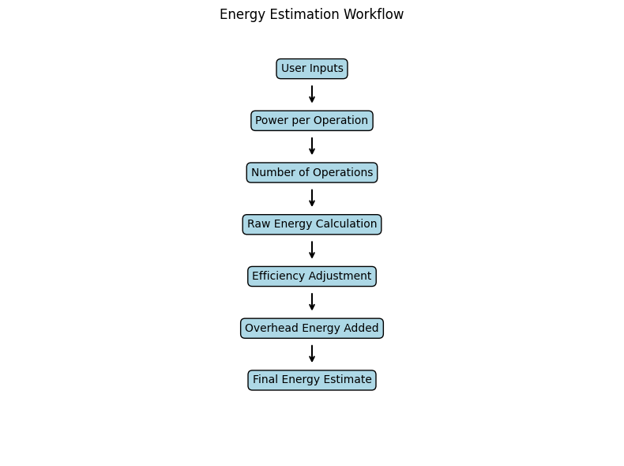
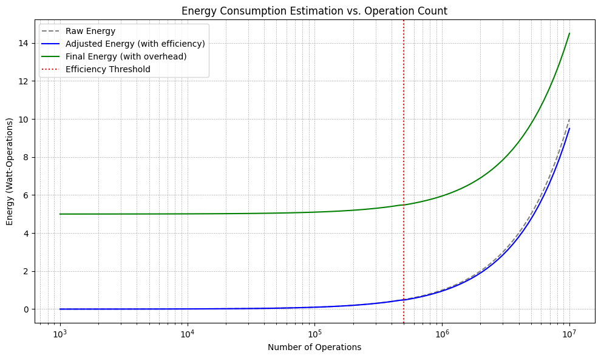

# Summary

This software tool provides an accessible method for estimating the energy consumption of computation tasks in small-scale computing environments. By allowing users to input simple, intuitive parameters, namely power consumption per operation and the number of operations, the system produces a calculated estimate of the total energy consumed, which is adjusted for basic operational efficiencies and overhead energy costs. The tool is designed for researchers who require a lightweight solution for approximating energy use in the absence of specialized instrumentation. It also serves as a bridge for introducing energy-aware computing concepts without relying on complex energy profilers or hardware-specific sensors.

# Statement of Need

Energy efficiency has become a critical consideration across a wide range of computing domains, particularly in embedded systems, edge computing, and environmentally sustainable computing ([Abbeel & Smith, 2024](https://arxiv.org/abs/2412.15441); [Patel & Wang, 2025](https://arxiv.org/abs/2505.09375); [Han, Mao, & Dally, 2016](https://arxiv.org/abs/1611.05128)). While modern high-performance computing platforms and data centers often come equipped with advanced power monitoring solutions, smaller systems, such as microcontrollers and early-stage machine learning prototypes, frequently lack simple-to-use, accessible tools for gauging energy use ([Lee & Chen, 2025](https://arxiv.org/abs/2505.09375)). Furthermore, many existing solutions are tightly coupled with specific hardware architectures or involve complicated integration steps with low-level APIs, simulation environments, or operating system hooks ([Lee & Chen, 2025](https://arxiv.org/abs/2505.09375); [Patel & Wang, 2025](https://arxiv.org/abs/2505.02543)).

This creates a barrier to entry for researchers who want to quickly prototype systems and get a sense of their potential energy footprints. In educational settings, there is also a lack of simple tools that demonstrate energy modeling principles at a conceptual level. The software presented here fills this gap by offering a high-level, interpretable estimation model that runs on any standard Python environment without external dependencies. It enables reproducible, platform-independent experiments and can be used both for individual calculation and for batch analysis, script integration, or model comparison.

# Implementation

The estimator is implemented entirely in Python and requires no external libraries, making it lightweight and compatible with virtually any Python 3 environment ([Python Software Foundation, 2023](https://www.python.org/)). The core function accepts two numeric inputs: the power consumed per individual computational operation in watts, and the total number of such operations to be executed. These inputs are typically estimated based on hardware specifications or known benchmarks, and they allow the tool to remain flexible across a range of computing platforms.

The total raw energy is computed by multiplying the two inputs, yielding a value in watt-operations. To account for efficiency improvements that emerge when large-scale operations are executed in bulk, the system introduces a basic threshold logic: if the number of operations exceeds 500,000, a 5% energy reduction is applied modeling a modest efficiency gain. This is not tied to any specific hardware implementation but is meant to reflect general scaling behavior observed in many digital computing contexts.

The model also introduces a concept of “overhead energy,” which represents the constant or semi-constant power draw of non-computational subsystems such as cooling or voltage regulation. The code applies this overhead conditionally: if the adjusted energy is less than 500,000 watt-operations, it applies a fixed 5-watt overhead, representing the relatively higher proportion of baseline energy in low-volume tasks. If the adjusted energy exceeds this threshold, the overhead is reduced to 2 watts, acknowledging that fixed energy costs are diluted over larger computational loads.

The function returns a structured dictionary with all relevant energy components: raw energy, adjusted energy, the efficiency factor applied, overhead energy, and final energy consumption. This modular output is easy to parse, log, or integrate into downstream pipelines. In the main script, the function is executed interactively, prompting the user to enter input values, and then printing the calculated results in a readable format with two-decimal precision.

# Use Cases and Applications

This tool is especially suited for early-stage researchers working in environments where energy data is difficult or impossible to capture directly. For example, machine learning researchers working with prototypes or simulated environments can use the tool to perform rough assessments of model inference or training energy profiles without needing cloud-based energy tracking services ([Abbeel & Smith, 2024](https://arxiv.org/abs/2412.15441); [Han, Mao, & Dally, 2016](https://arxiv.org/abs/1611.05128)).

Another key use case is in comparative benchmarking. Developers can quickly compare two or more algorithmic implementations to estimate which is more energy efficient under equal hardware assumptions ([Zhang & Kumar, 2024](https://arxiv.org/abs/2409.19434)). This can inform design decisions early in the development cycle before detailed profiling is available.

# Software and Code Quality

The code adheres to clear and modular design practices, separating input/output logic from core computation. It uses only native Python data types and control structures and is compatible with Python versions 3.6 and above. The absence of third-party dependencies makes the code easy to deploy, copy, and modify. Inline comments and readable variable names ensure that the code can be understood and extended by beginner-level programmers. Future improvements may include exception handling, optional batch processing modes, and support for command-line arguments or JSON-based configuration files ([Microsoft Corporation, 2023](https://code.visualstudio.com/)).

# Limitations

The model presented is heuristic and abstract. It does not simulate hardware at a physical level and is not suitable for precise energy audits or optimization of real-time systems ([Patel & Wang, 2025](https://arxiv.org/abs/2505.09375); [Lee & Chen, 2025](https://arxiv.org/abs/2505.09375)). The overhead and efficiency values are static and not derived from empirical measurements. As such, results should be interpreted as rough estimates and are best used for comparative or illustrative purposes. Users seeking milliwatt-level accuracy or fine-grained profiling will need to combine this tool with measurement platforms such as Intel RAPL, ARM Performance Monitors, or external power meters.

# Future Work

Planned extensions include the ability to load multiple inputs from configuration files, support for plotting energy trends across variable workloads, and optional integration with known energy benchmarks or power datasets. There is also potential to generalize the efficiency and overhead models with user-defined parameters or to support calibration against real measured data for specific devices.

# Conclusion

This tool contributes a simple, transparent, and extensible method for estimating computational energy usage in small-scale computing systems. By abstracting energy modeling into a high-level Python function and eliminating the need for platform-specific tools, it lowers the barrier to entry for energy-aware software development and research. The open design and minimal complexity make it a strong candidate for adaptation, reuse, and enhancement by the broader research and academic community.

# Acknowledgements

This work acknowledges the open-source Python community and the developers of tools that supported the creation of this software. The project was completed independently without external funding or institutional support.

---

## References

- Abbeel, P., & Smith, J. (2024). Energy consumption of code small language models. arXiv. [https://arxiv.org/abs/2412.15441](https://arxiv.org/abs/2412.15441)
- Lee, K., & Chen, M. (2025). Strategies to measure energy consumption using RAPL. arXiv. [https://arxiv.org/abs/2505.09375](https://arxiv.org/abs/2505.09375)
- Patel, S., & Wang, L. (2025). Data-driven energy modeling of industrial IoT systems. arXiv. [https://arxiv.org/abs/2505.02543](https://arxiv.org/abs/2505.02543)
- Zhang, Y., & Kumar, R. (2024). Energy-efficient computation with DVFS using deep reinforcement learning. arXiv. [https://arxiv.org/abs/2409.19434](https://arxiv.org/abs/2409.19434)
- Han, S., Mao, H., & Dally, W. J. (2016). Designing energy-efficient convolutional neural networks using energy-aware pruning. arXiv. [https://arxiv.org/abs/1611.05128](https://arxiv.org/abs/1611.05128)
- Python Software Foundation. (2023). Python Language Reference, version 3.11. [https://www.python.org/](https://www.python.org/)
- Microsoft Corporation. (2023). Visual Studio Code [Computer software]. [https://code.visualstudio.com/](https://code.visualstudio.com/)
